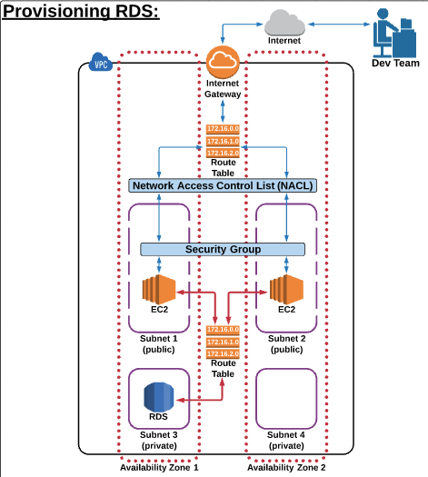

# Amazon RDS

## RDS and DynamoDB Basics

- RDS (relational database service) for SQL - { amazon aurora, mysql, mariadb, postgresql, oracle, MSSQL)
- DynamoDB for NoSQL - { MongoDB, Cassandra DB, Oracle NoSQL }

**_RDS_**
- Free tier does not include amazon aurora in RDS, 
- Pricing based on;

    Engine (mysql, postgres) + RDS instance class + purchasing terms(ondemand+reserved) + db storage + data transfer (i/o operations)
    
**_DynamoDB_**
- Free tier only includes Mongodb.
- Pricing based on;
    
    Provisioned througput capicity + indexed data storage + dynamodb streams + reserved capacity + data transfer (in/out)
    
 
## Provisioning RDS

We launch an RDS database in our private subnet because of security and also EC2 can communicate with other aws service such as rds inside private subnet.    
To enable connection to our db from outside our VPS, we will do the following, 

- Create a SSH tunnel to our Public subnet to EC2, then from this EC2 we go to connect internelly to RDS instance.

    
    
    
    
    
    
    
    
    
    
    
    
    
    
    
    
    
    
    
    
    
    
    
    
    
    
    
    
    
    
    
    
    
    
    
    
    
    
    
    
    
    
    
    
    