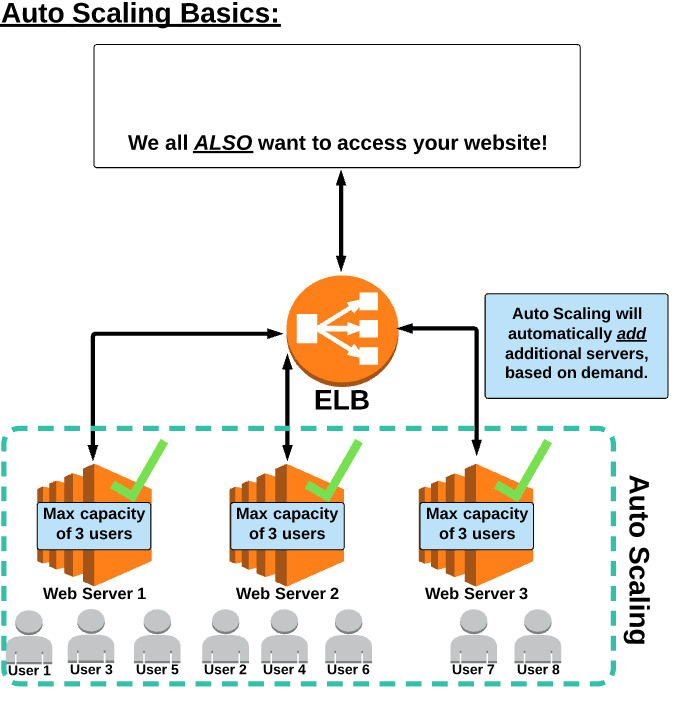

# AWS Auto Scaling

- Automate the process of adding up (scaling up) or removing (scaling down) EC2 instance based on traffic demand for your application.
- It's a service not a physical part of aws.
- Works with Load Balancer to scale up or down.

Auto Scaling is the process of scaling up and scaling down the number of EC2 instances based on traffic demands.

What are the main two components of Auto Scaling? 
    Launch Configuration and Auto Scaling Group

Auto scaling provides automation that contributes to highly available and fault tolerant architecture. Auto scaling is not used to send messages (you are thinking of SNS).

Auto Scaling is free to use, but you are responsible to pay for any AWS resources that Auto Scaling provisions
