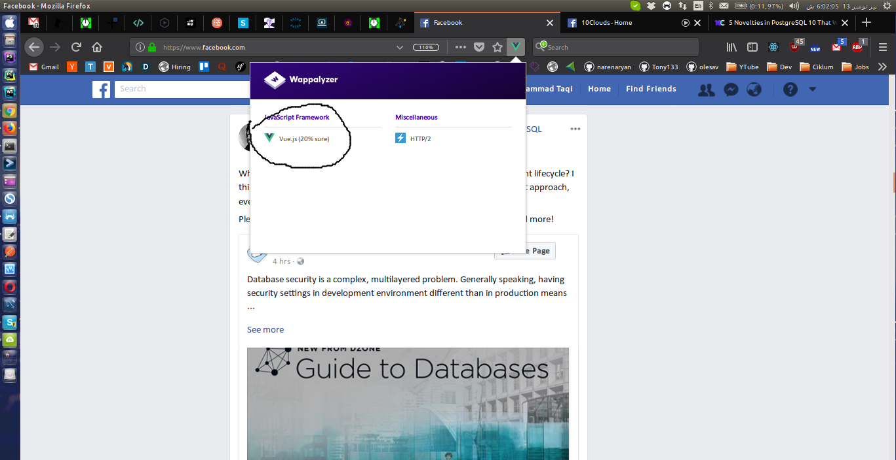

# Amazon EC2 (Elastic Compute Cloud)

## EC2 Basics

- Amazon cloud computer/server you use. 
    - AMIs (LINUX or Windows) - OS
    - Instance type (Processing power) - CPU
    - EBS (local storage) - Hard Drive
    - IP addressing (Internet access) - Network Card
    - Security Groups (security) - Firewall
    - RAM
- Scalable (increase compute powers as you need)
- Only charged when instance is running (per hour)

**_Purchasing Options_**

- **On-demand** - choose any instance type, launch it, start and stop it on demand, charged when instance is running (per hour) most expensive.
- **Reserved** - purchase a instance for **set period of time** (i.e 1 day, 1 week, 1 to 3 years), payment can be upfront, partial upfront, no upfront, charged for whole specific time. 
- **Spot** - you set a **bid** on any instance type and when an EC2 instance becomes available at **equal or below** to your bid price, your instance will run, else your instance will not be accessible.
AWS Spot Instance purchasing option allows us to purchase unused Amazon EC2 computer capacity at a highly-reduced rate. The instances are acquired through a bidding process in which the customer specifies a price per hour he is willing to pay. Spot instances on AWS are up to 90% cheaper than on-demand instances.

**_EC2 Pricing Cal_**

EC2 price can be different and is based on below options 

- Purchasing Option + Instance types + EBS Optimized + AMI type + Data transfer (In/out) + Region

**_Features of Amazon EC2_**

Amazon EC2 provides the following features:

- Virtual computing environments, known as instances
- Preconfigured templates for your instances, known as Amazon Machine Images (AMIs), that package the bits you need for your server (including the operating system and additional software)
- Various configurations of CPU, memory, storage, and networking capacity for your instances, known as instance types
- Secure login information for your instances using key pairs (AWS stores the public key, and you store the private key in a secure place)
- Storage volumes for temporary data that's deleted when you stop or terminate your instance, known as instance store volumes
- Persistent storage volumes for your data using Amazon Elastic Block Store (Amazon EBS), known as Amazon EBS volumes
- Multiple physical locations for your resources, such as instances and Amazon EBS volumes, known as regions and Availability Zones
- A firewall that enables you to specify the protocols, ports, and source IP ranges that can reach your instances using security groups
- Static IPv4 addresses for dynamic cloud computing, known as Elastic IP addresses
- Metadata, known as tags, that you can create and assign to your Amazon EC2 resources
- Virtual networks you can create that are logically isolated from the rest of the AWS cloud, and that you can optionally connect to your own network, known as virtual private clouds (VPCs)

## EC2 AMIs (Amazon machine images)

- A pre-configured package required to launch an EC2 instance, includes an OS, Software packages and other configs.
- Can launch as many instance from same AMI.
- You can have your own AMI or can get from Community AMIs (free) or AWS Marketplace (paid).

**_AMI Components_**

- Root Volume Templates (OS + application software)
- Launch Permissions ()
- Block Device Mappings (EBS mapping to Volume)

## EC2 Instance Types

- instance is the compute (CPU + hardware) power of your instance. 
- aws provide different types of instance based on hardware with different prices like instance with RAM, CPU, Hard drive, bandwidth capicity etc.
    - Faimly - 
    - type
    - vCPUs - 
    - Memory (GIB) - 
    - Instance Storage (GB) - 
    - EBS-Optimized Avaliable - 
    - Network Performance - 
    
## EBS (Amazon Elastic Block Store) Volumes 

- Amazon Elastic Block Store (EBS) is a service for providing block storage to your EC2 instances. In other words, it provides reliable volumes (hard drives) to your cloud servers.
- Highly available and reliable and can be attached to any running instance.

**_IOPS (Input Output Operations per second)_**

- the amount of data that can be written or retrieve from ebs.
- more IOPS means better performance (means faster input/output)
- what determince the amount of IOPS? EBS volume size, Larger the storage size (GB), the more IOPS the volume has. 256 for SSD volumes and 1024 KB for HDD volumes, because SDD volumes handle small or random IO much more effciently than HDD volumes.

**_Root vs Additional EBS volumes_**

- every EC2 instance have default root volumes, and if you want more you can mount the SSD as an additional drive - this can be handy for swap space, temporary files, caches, etc.
- When you are about to terminate an instance you have option to either destroy the root EBS also or not. same for additional EBS. this allow us to swap our root/additional ebs volumes with different instance.

**_EBS Snapshot?_**

- An EBS snapshot is a point-in-time backup of your EBS volume. It is a **copy** of the data on your EBS volume.
- If you are looking for a disaster-recovery solution for your EBS volume, this is the solution.
- If you want to “backup” your EC2 instance, then you want to create EBS snapshots of the EBS volumes attached to the instance.

Read More about [EBS Snapshots!](ebs-snapshots-explained.md)

## EC2 Security Groups

- firewall to similer to NACLs to allow/deny traffic but it's applied to Instance level.
- evaluate all of the security rules then decide what to do instead of low to hight rules in case of NACLs.
- You can only configure ALLOW rules for security groups. If there is not an explicit allow rules for a certain traffic type, then that traffic type will be denied.

## EC2 IP addressing

- Provide EC2 instance with public IP address.
- IP address is instance address on the network.

**_private ip_** - be default each instance have private, these are used with same VPC to communicate with each other.
**_public ip_** -  EC2 instance can be launched with or without public ip, but it is required to connect with internet/out of your VPC.

## Launching an EC2 Instance

**_Launching_**

1. SELECT an AMI
2. Select an Instance type
3. Configure Instance details;
4. Add Storage
5. Add a Tag (give the instance a name)
6. Configure/assign a Security Group
7. Review & Launch
8. Create & download Key Pair

## Types of EC2 Computing Instances:

AWS EC2 offers 5 types of instances which are as follows:

1. General Instances (t2, m4, m3)
    For applications that require a balance of performance and cost. E.g email responding systems, where you need a prompt response as well as the it should be cost effective, since it doesn’t require much processing.
2. Compute Instances (c4, c3)
    For applications that require a lot of processing from the CPU. E.g analysis of data from a stream of data, like Twitter stream
3. Memory Instances (r3, x1)
    For applications that are heavy in nature, therefore, require a lot of RAM. E.g when your system needs a lot of applications running in the background i.e multitasking.
4. Storage Instances (i2, d2)
    For applications that are huge in size or have a data set that occupies a lot of space. E.g When your application is of huge size.
5. GPU Instances (g2)
    For applications that require some heavy graphics rendering. E.g 3D modelling etc.

## What you know 

- You can only configure ALLOW rules for security groups. If there is not an explicit allow rules for a certain traffic type, then that traffic type will be denied.
- Every EC2 instance is automatically assigned a private IP address. Public IP addresses are optional, but are required for direct Internet access.
- Through the route table, resources inside of the VPC can always communicate with each other. However, the route table MUST have a designated route to the IGW for there to be Internet access.

Launch a Linux Virtual Machine
===============================
Step 1: Launch an Amazon EC2 Instance
EC2 console > launch instance

Step 2: Configure your Instance
a. Amazon Linux AMI
b. t2.micro > default options
c. review and launch 
d. create new key pair > "MyKeyPair" > Download key pair
Windows users: We recommend saving your key pair in your user directory in a sub-directory called .ssh (ex. C:\user\{yourusername}\.ssh\MyKeyPair.pem).
Mac/Linux users: We recommend saving your key pair in the .ssh sub-directory from your home directory (ex. ~/.ssh/MyKeyPair.pem).
Note: On Mac, the key pair is downloaded to your Downloads directory by default. 
To move the key pair into the .ssh sub-directory, enter the following command in a terminal window: mv ~/Downloads/MyKeyPair.pem ~/.ssh/MyKeyPair.pem

click Launch instance

e. EC2 > View instances
f. make note of public ip address of the new instance

Step 3: Connect to your Instance
Windows users:  Select Windows below to see instructions for installing Git Bash.
Mac/Linux user: Select Mac / Linux below to see instructions for opening a terminal window.

a. instructions to install git bash
b. open git bash to run ssh command
c. connect to your instance

Windows users: Enter ssh -i 'c:\Users\yourusername\.ssh\MyKeyPair.pem' ec2-user@{IP_Address} (ex. ssh -i 'c:\Users\adamglic\.ssh\MyKeyPair.pem' ec2-user@52.27.212.125)
Mac/Linux users: Enter ssh -i ~/.ssh/MyKeyPair.pem ec2-user@{IP_Address} (ex. ssh -i ~/.ssh/MyKeyPair.pem ec2-user@52.27.212.125)

Note: if you started a Linux instance that isn't Amazon Linux, there may by a different user name that is used. 
common user names include ec2-user, root, ubuntu, and fedora. 
If you are unsure what the login user name is, check with your AMI provider.

You'll see a response similar to the following:

The authenticity of host 'ec2-198-51-100-1.compute-1.amazonaws.com (10.254.142.33)' can't be established. 
RSA key fingerprint is 1f:51:ae:28:df:63:e9:d8:cf:38:5d:87:2d:7b:b8:ca:9f:f5:b1:6f. 
Are you sure you want to continue connecting (yes/no)?

Type yes and press enter.

You'll see a response similar to the following:

Warning: Permanently added 'ec2-198-51-100-1.compute-1.amazonaws.com' (RSA) to the list of known hosts.

You should then see the welcome screen for your instance and you are now connected to your AWS Linux virtual machine in the cloud.

Step 4: Terminate Your Instance
a. EC2 console > instance > actions > Instance state > Terminate
b. confirm yes to terminate

Launch a Windows Virtual Machine
================================
Step 1: Enter the EC2 Dashboard
EC2 > console

Step 2: Create and Configure Your Virtual Machine
a. launch instance
b. Microsoft Windows Server 2012 R2 Base > select 
c. instance type > t2.micro > Review and launch
d. default options > launch

Step 3: Create a Key Pair and Launch Your Instance
a. popover > select "create a new key pair" > name: "MyKeyPair" > Download key pair > MyFirstKey.pem

Windows users: We recommend saving your key pair in your user directory in a sub-directory called .ssh (ex.C:\user\{yourusername}\.ssh\MyFirstKey.pem).
Mac/Linux users: We recommend saving your key pair in the .ssh sub-directory from your home directory (ex.~/.ssh/MyFirstKey.pem). 

b. Launch instance
c. on the next screen "View instances" > status

Step 4: Connect to Your Instance
connect using RDP

a. select instance > connect
b. login
The User name defaults to Administrator
To receive your password, click Get Password
c. choose MyFirstKey.pem > Decrypt password
d. save decrypted password in a safe location

Step 6: Connect to Your Instance
RDP client
a. Click download remote desktop file
b. enter username and password
you should be logged in!!

Step 7: Terminate Your Windows VM
a. EC2 Consolle > select instance > actions > Instance state > Terminate
b. confirm yes to terminate