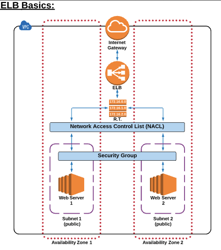

# AWS Elastic Load Balancer (ELB)

## ELB Basics

- An ELB evenly distributes traffic between EC2 instances that are associated with it.

- Not avaliable for Free tier
- Charged . Used per hour + data transfer from ELb (GB)

## Create ELB

1. EC2 -> ELB -> Classic Load Balancer.
2. Basic Configuration;
    - ELB name
    - Note: if ELB is serving web traffic, make sure ELB protocol set to HTTP/80 or HTTPS/443 for https.
3. Assign Security Groups;
    - set appropriate rules to setup traffic
4. Configure Security Settings;
    - if you choose https as traffic type
5. Configure Health checks;
    - select ping protocol to conduct health checks
6. Add EC2 instances; 
    - not require here, you can add later
7. Add Tags
8. Review and done.

## Notes

- An ELB's main purpose is to evenly distribute traffic between EC2 instances. An ELB can detect an unhealthy instance and divert traffic from it, but it cannot terminate an EC2 instance.
- Using an ELB with only one EC2 instance would provide NO additional benefit, and you would be charged money for using it.
- All Traffic/All Ports would work as it will allow HTTP traffic over port 80, but AWS best practices requires that you ONLY allow the LEAST amount of traffic types to meet the needs of your application. Therefore, HTTP/Port 80 is the only answer that satisfies the requirements.
- Health checks are required so that the ELB does not serve traffic to an unhealthy EC2 instance. 