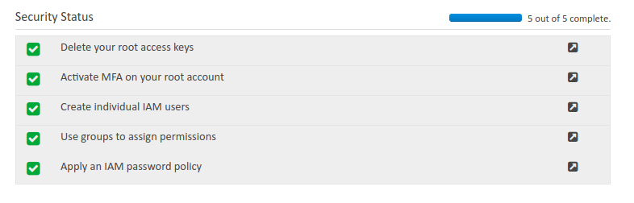

# 1.  AWS Identity and Access Management (IAM)

A web service that enables to manage users and user permissions within AWS.
    - User
    - Groups
    - IAM Access Polices
    - Roles
    
Note: The user created when you created your AWS account is called root user.

- By default the root user has full admin right.
- By default, the new user you created has no access to any service except for login only.
- For all users other then root, permission musts be granted to access teh aws services.

## 2.  IAM Setup

### 2.1  IAM initial Configuration

When new AWS root account is created, **best practice** is to complete the task listed in IAM under **Security Status**, those are;

- delete your root access key
- activate **MFA (Multi factor Authentication)** on your root account
- create Individual IAM users
- users groups to assign permissions
- apply an IAM password policy

**_MFA_**

An additional layer of security on AWS root account. Once you enable AWS MFA, you must provide a six-digit, single-use code in addition to your sign-in credentials whenever you access secure AWS webpages or the AWS Management Console. 
You get this single-use code from an authentication device (Google Authenticator) that you keep in your physical possession.

**_Individual IAM User_**

## 3.  IAM Users and Policies

- create new user, edit user, from permissions tab assign any permission to user i.e AmazonS3FullAccess, AmazonS3ReadOnlyAccess, AmazonEC2FullAccess etc. 

## 4.  IAM Groups and Policies

- instead of assign each user permissions, we create groups, attach polices to groups and then add users to their respective groups.

## 5.  IAM Roles

- to communication between two or more AWs services, we attach roles to them, so what a role does, it allows other aws services to communicate with our aws services with custom rules and restriction. in other way, it almost act like a user. i.e granting ec2 instance to access S3 service.
- act as groups for aws users instead of aws users.

**_So, What you know _**

- Multi-Factor Authentication (MFA) is an important part of account security that should be set on your "root" account.
- IAM polices can be directly attached to each of the following EXCEPT:
- If a user has access to S3 through a group with an S3 policy attached, what happens if that user is removed from the group?
- IAM is where you manage your AWS users and their access to AWS features and services.
- If you want to grant S3 access to an EC2 instance, what should you do?

