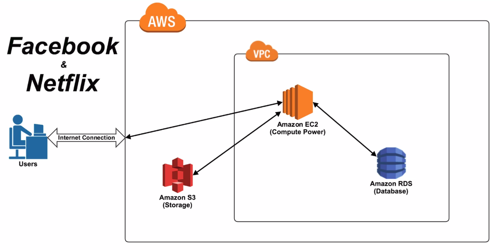

# Cloud Terminology – Key Definitions

- High availability  – "100% operational performance, usually uptime" or "never failing" for a higher than normal period across multiple systems/devices (web/mobile etc).

- Scalability  – "Increasing" the capacity to meet the "increasing" workload. "long-term, strategic needs".

- Elasticity   – "Increasing or reducing" the capacity to meet the "increasing or reducing" workload. "short-term, tactical needs".

# AWS Terminology – Key Definitions

- Instance  – ec2 server

- Amazon Machine Images (AMIs)   – Preconfigured templates for your instances, known as Amazon Machine Images (AMIs), that package the bits you need for your server (including the operating system and additional software)

- RDS - amazon database platform

- Latency - 

- Amazon S3, Amazon Elastic Beanstalk and Amazon EC2 - 

- Project Omega - https://www.lucidchart.com/documents/view/703f6119-4838-4bbb-bc7e-be2fb75e89e5/0

- The Orion Papers

## AWS Basic Arch

- VPS (Virtual Private Cloud)  – place for your aws resources with allow/restriction options.

    - EC2  – virtual computer server or instance
    
    
# EC2

Limits:
======
VPCs per region: 5
Subnets per VPC: 200
IGW per region: 5
VGW per region: 5
CGW per region: 50
VPN connections per region: 50
Route tables per VPC: 200 (including main route table)
Entries per route table: 50
EIP per region for each account: 5
Security groups per VPC: 100
Rules per security group: 50 (per network interface max limit: 250)
Security groups per network interface: 5
Network ACLs per VPC: 200
Rules per ACL: 20
BGP advertised routes per VPN Connection: 100
Active VPC peering connections per VPC: 50
Outstanding VPC peering connection requests: 25

IAM:
----
Interfaces:
1. AWS management console
2. CLI
3. IAM Query API
4. Existing Libraries

MyISAM (non transaction db)
---------------------------
steps to creating a read replica:
1. stop all DDL and DML operations on non transactional tables and wait for them to complete. SELECT statement can continue running
2. Flush and lock those tables
3. Create read replica using CreateDBInstanceReadReplica API
4. Check progress of replication using DescribeDBInstance API
5. Once replica is available unlock tables and resume normal database operations

CloudFront - Alternate Domain Names:
-------------------------------------
/images/image.jpg > http://www.mydomain.com/images/image.jpg
instead of http://d111111abcdef8.cloudfront.net/images/image.jpg

1. add CNAME for www.mydomain.com to your distribution
2.update or cretae CNAME record with your DNS service to route queries

Elasticity:
----------
3 ways of implementing:
1. Proactive cycle scaling - periodic scaling that occurs at fixed intervals (daily, weekly, monthly, quarterly)
2. Proactive event based scaling - scaling based on event like a big surge of traffic requests due to a scheduled business event (new product launc, marketing campaigns, etc.)
3. Auto-scaling based on demand: by using a monitoring service, your system can send triggers to take appropriate actions, scale up or down based on metrics (utilization of servers, network I/O)

Instance stores:
-------------------
Data on instance stores persists only during life of the instance
If an instance reboots then data persists

Data is lost under following scenarios:
- Failure of an underlying drive
- Stopping and Amazon EBS backed instance
- Terminating an instance

Therefore, do not rely on instance store volumes for long term data 
instead keep replication strategy across multiple instances, storing data on S3 or using EBS volumes

CloudFront instance id:
----------------------
Logical ID and physical ID 
physical ID can be used to view instance and properties through EC2 console but can only be accessed once cloudfront has created the resources.
logical id is used for mapping resources e.g. EBS to an instance -> logical ids for both EBS and EC2 instance to specify the mapping  

Elastic load balancer:
----------------------
Internet facing load balancer - DNS name, public IP and IGW (internet gateway)
Internal load balancer - DNS name and private IP 
DNS of both load balancers are publicly resolvable
Flow: Internet facing load balancer > DNS resolve > Webservers > Internal load balancer > DNS resolve > private IPs > backend instances within the private subnet
application instances behind the load balancer do not need to be in the same subnet

Auto-scaling AMI:
------------------
AMI ID used in Auto scaling policy is configured in the "launch configuration" 
There are differences between creating a launch configuration from scratch and creating a launch configuration from an existing EC2 instance. When you create a launch configuration from scratch, you specify the image ID, instance type, optional resources (such as storage devices), and optional settings (like monitoring). When you create a launch configuration from a running instance, by default Auto Scaling derives attributes for the launch configuration from the specified instance, plus the block device mapping for the AMI that the instance was launched from (ignoring any additional block devices that were added to the instance after launch).

When you create a launch configuration using a running instance, you can override the following attributes by specifying then as part of the same request: AMI, block devices, key pair, instance profile, instance type, kernel, monitoring, placement tenancy, ramdisk, security groups, Spot price, user data, whether the instance has a public IP address is associated, and whether the instance is EBS-optimized.

Amazon RDS - High Availability (Multi-AZ)
-----------------------------------------

Amazon RDS provides high availability and failover support for DB instances using Multi-AZ deployments. Multi-AZ deployments for Oracle, PostgreSQL, MySQL, and MariaDB DB instances use Amazon technology, while SQL Server DB instances use SQL Server Mirroring.

Note
Amazon Aurora stores copies of the data in a DB cluster across multiple Availability Zones in a single region, regardless of whether the instances in the DB cluster span multiple Availability Zones. For more information on Amazon Aurora, see Aurora on Amazon RDS.
In a Multi-AZ deployment, Amazon RDS automatically provisions and maintains a synchronous standby replica in a different Availability Zone. The primary DB instance is synchronously replicated across Availability Zones to a standby replica to provide data redundancy, eliminate I/O freezes, and minimize latency spikes during system backups. Running a DB instance with high availability can enhance availability during planned system maintenance, and help protect your databases against DB instance failure and Availability Zone disruption. For more information on Availability Zones, see Regions and Availability Zones.

Note
The high-availability feature is not a scaling solution for read-only scenarios; you cannot use a standby replica to serve read traffic. To service read-only traffic, you should use a Read Replica. For more information, see Working with PostgreSQL, MySQL, and MariaDB Read Replicas.

AWS Storage Gateway:
---------------------
AWS Storage Gateway connects an on-premises software appliance with cloud-based storage to provide seamless integration with data security features between your on-premises IT environment and the Amazon Web Services (AWS) storage infrastructure. You can use the service to store data in the AWS Cloud for scalable and cost-effective storage that helps maintain data security. AWS Storage Gateway offers file-based, volume-based and tape-based storage solutions
1. File Gateway: file interface to S3
2. Volume Gateway: iSCSI devices on premise 
- cached volumes > S3 > low latency access
3. Tape Gateway: backup data to Amazon Glacier
- stored volumes > S3 > asynchronous backup from on premise to point in time snapshots

AWS Cloud Formation:
--------------------
AWS CloudFormation gives developers and systems administrators an easy way to create and manage a collection of related AWS resources, provisioning and updating them in an orderly and predictable fashion.

You can use AWS CloudFormation�s sample templates or create your own templates to describe the AWS resources, and any associated dependencies or runtime parameters, required to run your application. You don�t need to figure out the order for provisioning AWS services or the subtleties of making those dependencies work. CloudFormation takes care of this for you. After the AWS resources are deployed, you can modify and update them in a controlled and predictable way, in effect applying version control to your AWS infrastructure the same way you do with your software. You can also visualize your templates as diagrams and edit them using a drag-and-drop interface with the AWS CloudFormation Designer.

ELB limitations - pre-warming:
-----------------------------
For pre-warming following details required from customer:
1. Start or end dates of your test or expected flash traffic
2. Expected request rate per second
3. Total size of the request/response you'll be testing

Note: To ensure there is no outage during this setup we recommend Multi-AZ setup

Auto-scaling health checks:
---------------------------
Health Checks for Auto Scaling Instances

Auto Scaling periodically performs health checks on the instances in your Auto Scaling group and identifies any instances that are unhealthy. After Auto Scaling marks an instance as unhealthy, it is scheduled for replacement. For more information, see Replacing Unhealthy Instances.

Instance Health Status

An Auto Scaling instance is either healthy or unhealthy. Auto Scaling determines the health status of an instance using one or more of the following:

Status checks provided by Amazon EC2. For more information, see Status Checks for Your Instances in the Amazon EC2 User Guide for Linux Instances.
Health checks provided by Elastic Load Balancing. For more information, see Health Checks for Your Target Groups in the Application Load Balancer Guide or Configure Health Checks for Your Classic Load Balancer in the Classic Load Balancer Guide.
Custom health checks. For more information, see Instance Health Status and Custom Health Checks.
By default, Auto Scaling health checks use the results of the status checks to determine the health status of an instance. Auto Scaling marks an instance as unhealthy if its instance status is any value other than running or its system status is impaired.

If you have attached a load balancer to your Auto Scaling group, you can optionally have Auto Scaling include the results of Elastic Load Balancing health checks when determining the health status of an instance. After you add these health checks, Auto Scaling also marks an instance as unhealthy if Elastic Load Balancing reports the instance state as OutOfService. For more information, see Adding Health Checks to Your Auto Scaling Group.

Health Check Grace Period

Frequently, an Auto Scaling instance that has just come into service needs to warm up before it can pass the Auto Scaling health check. Auto Scaling waits until the health check grace period ends before checking the health status of the instance. While the EC2 status checks and ELB health checks can complete before the health check grace period expires, Auto Scaling does not act on them until the health check grace period expires. To provide ample warm-up time for your instances, ensure that the health check grace period covers the expected startup time for your application. Note that if you add a lifecycle hook to perform actions as your instances launch, the health check grace period does not start until the lifecycle hook is completed and the instance enters the InService state.

Instance Health Status and Custom Health Checks

If you have custom health checks, you can send the information from your health checks to Auto Scaling so that Auto Scaling can use this information. For example, if you determine that an instance is not functioning as expected, you can set the health status of the instance to Unhealthy. The next time that Auto Scaling performs a health check on the instance, it will determine that the instance is unhealthy and then launch a replacement instance.

Internet Gateways
-----------------

An Internet gateway is a horizontally scaled, redundant, and highly available VPC component that allows communication between instances in your VPC and the Internet. It therefore imposes no availability risks or bandwidth constraints on your network traffic.

An Internet gateway serves two purposes: to provide a target in your VPC route tables for Internet-routable traffic, and to perform network address translation (NAT) for instances that have been assigned public IPv4 addresses.

An Internet gateway supports IPv4 and IPv6 traffic.

Enabling Internet Access

To enable access to or from the Internet for instances in a VPC subnet, you must do the following:

Attach an Internet gateway to your VPC.
Ensure that your subnet's route table points to the Internet gateway.
Ensure that instances in your subnet have a globally unique IP address (public IPv4 address, Elastic IP address, or IPv6 address).
Ensure that your network access control and security group rules allow the relevant traffic to flow to and from your instance.
To use an Internet gateway, your subnet's route table must contain a route that directs Internet-bound traffic to the Internet gateway. You can scope the route to all destinations not explicitly known to the route table (0.0.0.0/0 for IPv4 or ::/0 for IPv6), or you can scope the route to a narrower range of IP addresses; for example, the public IPv4 addresses of your company�s public endpoints outside of AWS, or the Elastic IP addresses of other Amazon EC2 instances outside your VPC. If your subnet is associated with a route table that has a route to an Internet gateway, it's known as a public subnet.

To enable communication over the Internet for IPv4, your instance must have a public IPv4 address or an Elastic IP address that's associated with a private IPv4 address on your instance. Your instance is only aware of the private (internal) IP address space defined within the VPC and subnet. The Internet gateway logically provides the one-to-one NAT on behalf of your instance, so that when traffic leaves your VPC subnet and goes to the Internet, the reply address field is set to the public IPv4 address or Elastic IP address of your instance, and not its private IP address. Conversely, traffic that's destined for the public IPv4 address or Elastic IP address of your instance has its destination address translated into the instance's private IPv4 address before the traffic is delivered to the VPC.

To enable communication over the Internet for IPv6, your VPC and subnet must have an associated IPv6 CIDR block, and your instance must be assigned an IPv6 address from the range of the subnet. IPv6 addresses are globally unique, and therefore public by default.

In the following diagram, Subnet 1 in the VPC is associated with a custom route table that points all Internet-bound IPv4 traffic to an Internet gateway. The instance has an Elastic IP address, which enables communication with the Internet.

You can deploy and update a template and its associated collection of resources (called a stack) by using the AWS Management Console, AWS Command Line Interface, or APIs. CloudFormation is available at no additional charge, and you pay only for the AWS resources needed to run your applications.

Base URI for instance metadata:
--------------------------------
http://169.254.169.254/latest/meta-data/

$ curl http://169.254.169.254/latest/meta-data/

$ GET http://169.254.169.254/latest/meta-data/
You can also download the Instance Metadata Query tool, which allows you to query the instance metadata without having to type out the full URI or category names:

http://aws.amazon.com/code/1825

All instance metadata is returned as text (content type text/plain). A request for a specific metadata resource returns the appropriate value, or a 404 - Not Found HTTP error code if the resource is not available.

EC2 stop running instance:
--------------------------
When you stop a running instance, the following happens:

The instance performs a normal shutdown and stops running; its status changes to stopping and then stopped.
Any Amazon EBS volumes remain attached to the instance, and their data persists.
Any data stored in the RAM of the host computer or the instance store volumes of the host computer is gone.
In most cases, the instance is migrated to a new underlying host computer when it's started.
EC2-Classic: We release the public and private IPv4 addresses for the instance when you stop the instance, and assign new ones when you restart it.
EC2-VPC: The instance retains its private IPv4 addresses and any IPv6 addresses when stopped and restarted. We release the public IPv4 address and assign a new one when you restart it.
EC2-Classic: We disassociate any Elastic IP address that's associated with the instance. You're charged for Elastic IP addresses that aren't associated with an instance. When you restart the instance, you must associate the Elastic IP address with the instance; we don't do this automatically.
EC2-VPC: The instance retains its associated Elastic IP addresses. You're charged for any Elastic IP addresses associated with a stopped instance.
When you stop and start a Windows instance, the EC2Config service performs tasks on the instance such as changing the drive letters for any attached Amazon EBS volumes. For more information about these defaults and how you can change them, see Configuring a Windows Instance Using the EC2Config Service in the Amazon EC2 User Guide for Windows Instances.
If you've registered the instance with a load balancer, it's likely that the load balancer won't be able to route traffic to your instance after you've stopped and restarted it. You must de-register the instance from the load balancer after stopping the instance, and then re-register after starting the instance. For more information, see Register or Deregister EC2 Instances for Your Classic Load Balancer in the Classic Load Balancer Guide.
If your instance is in an Auto Scaling group, the Auto Scaling service marks the stopped instance as unhealthy, and may terminate it and launch a replacement instance. For more information, see Health Checks for Auto Scaling Instances in the Auto Scaling User Guide.
When you stop a ClassicLink instance, it's unlinked from the VPC to which it was linked. You must link the instance to the VPC again after restarting it. For more information about ClassicLink, see ClassicLink.
For more information, see Differences Between Reboot, Stop, and Terminate.

You can modify the following attributes of an instance only when it is stopped:

Instance type
User data
Kernel
RAM disk
If you try to modify these attributes while the instance is running, Amazon EC2 returns the IncorrectInstanceState error.

Stopping and Starting Your Instances

You can start and stop your Amazon EBS-backed instance using the console or the command line.

By default, when you initiate a shutdown from an Amazon EBS-backed instance (using the shutdown, halt, or poweroff command), the instance stops. You can change this behavior so that it terminates instead. For more information, see Changing the Instance Initiated Shutdown Behavior.

To stop and start an Amazon EBS-backed instance using the console

In the navigation pane, choose Instances, and select the instance.

[EC2-Classic] If the instance has an associated Elastic IP address, write down the Elastic IP address and the instance ID shown in the details pane.

Choose Actions, select Instance State, and then choose Stop. If Stop is disabled, either the instance is already stopped or its root device is an instance store volume.

Warning
When you stop an instance, the data on any instance store volumes is erased. Therefore, if you have any data on instance store volumes that you want to keep, be sure to back it up to persistent storage.
In the confirmation dialog box, choose Yes, Stop. It can take a few minutes for the instance to stop.

[EC2-Classic] When the instance state becomes stopped, the Elastic IP, Public DNS (IPv4), Private DNS, and Private IPs fields in the details pane are blank to indicate that the old values are no longer associated with the instance.

While your instance is stopped, you can modify certain instance attributes. For more information, see Modifying a Stopped Instance.

To restart the stopped instance, select the instance, choose Actions, select Instance State, and then choose Start.

In the confirmation dialog box, choose Yes, Start. It can take a few minutes for the instance to enter the running state.

[EC2-Classic] When the instance state becomes running, the Public DNS (IPv4), Private DNS, and Private IPs fields in the details pane contain the new values that we assigned to the instance.

[EC2-Classic] If your instance had an associated Elastic IP address, you must reassociate it as follows:

In the navigation pane, choose Elastic IPs.

Select the Elastic IP address that you wrote down before you stopped the instance.

Choose Actions, and then select Associate address.

Select the instance ID that you wrote down before you stopped the instance, and then choose Associate.

To stop and start an Amazon EBS-backed instance using the command line

You can use one of the following commands. For more information about these command line interfaces, see Accessing Amazon EC2.

stop-instances and start-instances (AWS CLI)
Stop-EC2Instance and Start-EC2Instance (AWS Tools for Windows PowerShell)
Modifying a Stopped Instance

You can change the instance type, user data, and EBS-optimization attributes of a stopped instance using the AWS Management Console or the command line interface. You can't use the AWS Management Console to modify the DeleteOnTermination, kernel, or RAM disk attributes.

To modify an instance attribute

To change the instance type, see Resizing Your Instance.
To change the user data for your instance, see Configuring Instances with User Data.
To enable or disable EBS�optimization for your instance, see Modifying EBS�Optimization.
To change the DeleteOnTermination attribute of the root volume for your instance, see Updating the Block Device Mapping of a Running Instance.
To modify an instance attribute using the command line

You can use one of the following commands. For more information about these command line interfaces, see Accessing Amazon EC2.

modify-instance-attribute (AWS CLI)
Edit-EC2InstanceAttribute (AWS Tools for Windows PowerShell)
Troubleshooting

If you have stopped your Amazon EBS-backed instance and it appears "stuck" in the stopping state, you can forcibly stop it. For more information, see Troubleshooting Stopping Your Instance.
