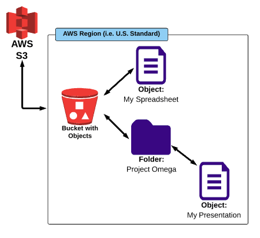
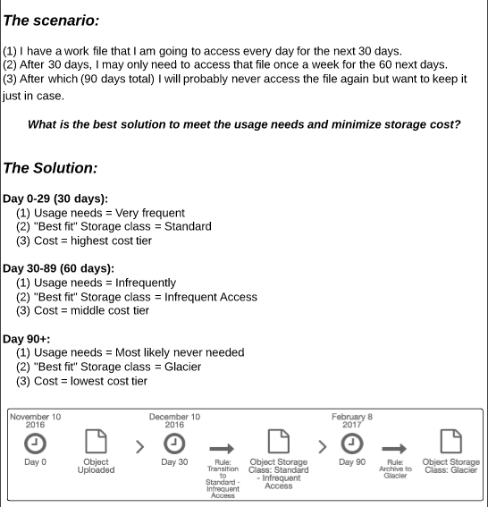

# AWS S3 (Simple Storage Service)

## S3 Basics

- An online, bulk storage service that you can access from any device. It's AWs primary storage service.
- Amazon Grantees 99.99% availability and 99.999999999% durability for data which is stored on S3 cloud Storage.
- S3 can’t be used to install operating system or database and you need block based storage for those. Here is the few examples for the object based storage and block based storage in traditional environments.
    - Object Based Storage :  NFS , CIFS , SMBFS ..etc..
    - Block based Storage : ext3, ext4 , ZFS , vxfs , XFS ..etc.

**_bucket_** - root level folder
**_folder_** - folder inside bucket
**_object_** - any file in folder. *_An object_ is the fundamental entity in S3. It consists of data, key and metadata.
**_regions_** - any data you upload to s3 bucket will be physically located in a data center in that region. best practice to select closest to you/customer, to reduce transfer latency.

## **What is AWS S3 ?**

Amazon Simple Storage Service (S3) is a storage for the internet. It is designed for large-capacity, low-cost storage provision across multiple geographical regions. Amazon S3 provides developers and IT teams with **Secure**, **Durable** and **Highly Scalable **object storage.

S3 is **Secure** because AWS provides:
* Encryption to the data that you store. It can happen in two ways:
    * Client Side Encryption
    * Server Side Encryption
* Multiple copies are maintained to enable regeneration of data in case of data corruption
* _Versioning,_ wherein each edit is archived for a potential retrieval.

S3 is **Durable** because:
* It regularly verifies the integrity of data stored using checksums e.g. if S3 detects there is any corruption in data, it is immediately repaired with the help of replicated data.
* Even while storing or retrieving data, it checks incoming network traffic for any corrupted data packets.

S3 is **Highly Scalable**, since it automatically scales your storage according to your requirement and you only pay for the storage you use.

### Storage Cost

**_Storage Cost_** - charged per GB used, may be different in different regions. applies to data at rest in S3.
**_Request Cost_** - moving data in/out of S3.

Check latest [Pricing Here!](https://aws.amazon.com/s3/pricing/)

## Buckets and Objects

**RULE :** Bucket names should be unique across every account/user in the AWs world.

**_Bucket Level Properties_**
- General Info
- Permissions
- Static Web hosting
- Logging
- Events
- Versioning
- Lifecycle
- Cross-region Replication
- Tags
- Requester Pays
- Transfer Acceleration

**_Folder Level Properties_**
- General Info
- Details

**_Object Level Properties_**

- General Info
- Details
- Permissions
- metadata

##  S3 Object Parameters:

- Key – File name of the Object Name
- Value – Actual Data – Made up a sequence of data.
- Version ID – File versioning .
- Metadata – Data about the date your are writing the file.
- Sub Resources – Access Control Lists

## Storage Classes

1. S3 Standard – 99.99% Availability + 99.999999999% Durability, designed for General and all purpose storage class, default and most expensive.
2. S3 RRS – (Reduced Redundancy Storage) – 99.99% Availability + 99.99 Durability, lower fee then S3 standard, designed for critical and non-reproducable objects.
3. s3 IA – (Infrequently Accessed Data) – 99.99% Availability + 99.999999999 Durability, Lower Fee than standard and RRS, designed for objects that do not access frequently, but must be avaliable when needed.
4. S3 Glacier – 99.999999999 Durability, Very Cheap but used only for long term archival storage. It take 4 to 5hrs to retrieve the data.

**_Object Durability_** - % over a one year time period that a file stored in S3 will not be lost. means if you have 10k files stored in S3, then you can expect to lose 1 file in 10 million years.
**_Object Availability_** - % over a one year time period that a file stored in S3 will be accessable. means for every 10k hours you can expect that the file will not be accessable for 1 hour.

- for new objects, storage class can be set duriing file upload (upload file, instead of hit upload button click set details) or using **Object lifecycle policies**
- for existing objects, use object properties to change between s3 standard, rrs and IA.
- for glacier, use **lifecycle properties**, this change may take 1 to 2 days to effect.

**Let's understand the 3 storage classes with a "health-care" use case:**

_1.Amazon S3 Standard_ for frequent data access - suitable for performance sensitive use cases where the latency should be kept low. e.g. in a hospital, frequently  accessed data will be the data of admitted patients, which should be retrieved quickly.
_2. Amazon S3 Standard_ - for infrequent data access, suitable for use cases where the data is long lived and less frequently accessed, i.e for data archival but still expects high performance. e.g. in the same hospital, people who have been discharged, their records/data will not be needed on a daily basis, but if they return with any complication, their discharge summary should be retrieved quickly.
_3.Amazon Glacier_ - suitable for use cases where the data is to be archived, and high performance is not required, it has a lower cost than the other two services.e.g. in the hospital, patients' test reports, prescriptions, MRI, X Ray, Scan docs etc. that are older than a year will not be needed in the daily run and even if it is required, lower latency is not needed.

##  S3 Object Lifecycle:

A process of rules that automates the migration from one class to another time to time.
Can be applied at bucket, folder, object level.

##  S3 Permissions

**_Bucket level_**  - list bucket's object, view/edit/delete bucket , view/edit bucket permissions
**_Object level_**  - open, download and edit access.

## S3 Versioning

- keeps track of and store all old/new version of object.
- can only be applied at bucket level.
- by default it is off, after turning on, you can't turn off but you can set suspend, so versions will not go farward but it will keep old version of files.
- usefull of having backups of your important files.

## Cross-region Replication

Cross-region Replication enables user to either replicate or transfer data to some other location without any hassle.

**How is the data transferred?**
* Transfer Acceleration
* Snowball

**Transfer Acceleration** enables fast, easy and secure transfers over long distances by exploiting Amazon's CloudFront edge technology. **CloudFront** is a caching service by AWS, in which the data from client site gets transferred to the nearest edge location and from there the data is routed to your AWS S3 bucket over an optimised network path. 
**Snowball** is a way of transferring your data physically. In this Amazon sends an equipment to your premises, on which you can load the data. It has a kindle attached to it which has your shipping address when it is shipped from Amazon. When data transfer is complete on the Snowball, ![Snowball - aws s3 tutorial - edureka][10]kindle changes the shipping address back to the AWS headquarters where the Snowball has to be sent. 

The Snowball is ideal for customers who have large batches of data move. The average turnaround time for Snowball is 5-7 days, in the same time Transfer Acceleration can transfer up to 75 TB of data on a dedicated 1Gbps line. So depending on the use case, a customer can decide.

Obviously, there will be some cost around it, let's look at the overall costing around S3.

## What you know 
- S3 is a bulk storage service where you can store any type of file.
- Which of the following is NOT a storage class?
- S3 stands for Simple Storage Solutions
- What feature MUST be used to change an object's storage class to Glacier?
- If you have an object that is easily reproducible and must be quickly accessable, what would be the best storage class to use for it?
- By setting proper permissions on the object level, you can allows the public to download the object via a URL.
- What is the S3 feature that allows to you store and access older iterations of objects?
- An S3 bucket name can have any name and format you like.

