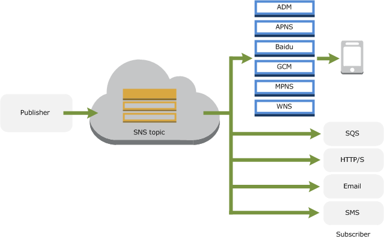

# AWS SNS (Simple Notification Service)

- Amazon SNS is a web service that you can use to publish messages from applications and deliver them to other services, applications, subscribers, internet and mobile devices, immediately and cost effectively. 
- you can also automates the sending of email or text message notifications, based on events happen in your AWS account.
- SNS pricing is usage based

> AWS describes Amazon SNS as a "fast, flexible, fully managed push notification service [to] send individual messages or fan-out messages to large numbers of recipients". It supports mobile push notifications to Apple, Google, Fire OS and Windows devices, as well as messages to HTTP endpoints, email recipients and other AWS services such as Amazon SQS and AWS Lambda.

SNS provides two different SMS pricing models, these being Transactional and Promotional.
- Promotional – cost optimized for "noncritical messages, such as marketing messages"
- Transactional – reliability optimized for "critical messages that support customer transactions, such as one-time passcodes for multi-factor authentication"

- Charges calculations ;
    publishes (messages) + subscribers (receivers) + Data transfer (in/out)

## What you can do with Amazon’s Simple Notification Service (SNS)

If you're looking to build a mobile (or desktop) application that delivers push notifications or SMS messages to mobile devices, then Amazon’s Simple Notification Service (SNS) is for you.

1. **_Push Notifications:_** Delivered push notifications and SMS messages to your multiple clients (IOS, android etc.) instantly deliver messages without device polling, Amazon’s free 1 million Push Notifications for AWS Free Tier. 
2. **_SMS Messaging:_**  Send singular or bulk SMS or MMS messages via SNS.
3. **_Devices:_** You can send to Apple, Google (including Android devices in China with Baidu Cloud Push), Fire OS, and Windows devices covering the majority of platforms you will ever need to send to.
4. **_Message analytics:_** You can track the performance of your notification service you can do so by measuring your message analytics with Amazon CloudWatch.
5. **_Your choice of platform:_** Access SNS using iOS, Android, Java, Python, PHP, Node.js, or .NET SDKs via Amazon Web Services. 
6. **_Pub-Sub Messaging:_** Publish-subscribe messaging patterns. This topic based means of sending messages is a great way to limit cost by sending messages to those who are interested in receiving specific notifications from you.
7. **_Scalable architecture:_** With no monthly message ceilings in place regarding send limits, data usage or even bounce data, you can get started using Amazon SNS’ using any one of their 3 simple to use APIs. 

It is also possible to monitor SMS activity via CloudWatch Metrics and Logs for SMS deliveries. Users can create CloudWatch alarms to receive alerts when metrics such as the number of failed deliveries cross thresholds and can further analyze each delivery via the corresponding CloudWatch Logs record:

## Works ?

In Amazon's SNS, there are 2 types of clients **publishers** and **subscribers** also refer as Publishers and consumers.

**_topics_** - label and groups different **endpoints** that you send messages to. Topics are the fundamental concept for message routing in a pub-sub architecture: Many subscribers listen to a topic and are notified whenever something publishes a message on that topic. Basically, it’s like JavaScript events, but you have to create a topic before you can subscribe.
**_subscribers_** - the endpoint tha a topic send messages to. (i.e email, phone number, sys admin)
**_publishers_** - use to send messages to topics, can be manually, Programmatic or event/alert based.

To get started with Amazon SNS, first create a topic, which is an access point for subscribers who are interested in receiving notifications about a specific subject. Developers publish a message to a topic when they have an update for subscribers and this action prompts Amazon SNS to distribute the message to all appropriate subscribers.

## Exercise

**_Create Topic_** - Create topic with any name you want
**_Add Subscriptions_** - create subscription (protocol).
**_Publishing to Topic_** - click on publish to topic, enter subject + message and publish.

