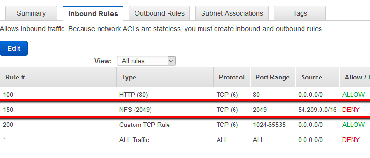

# 1.  AWS Virtual Private Cloud (VPC)

- A private sub-section of aws that you control, in which you places aws resources (ec2, s3, database), you have full control over who will access to aws resources inside your vpc.
- when you create an aws account, a default VPC is created for you that included standard components, 
    - Internet Gateway (IGW)
    - A routing table (pre-defined routes to default sub-nets)
    - A network access control list (predefined rules for access)
    - sub-nets to provision aws resources (i.e ec2 instances)

# 2.  [AWS Infrastructure!](https://aws.amazon.com/about-aws/global-infrastructure/)

**_Regions_**  – aws resources located in specific geographical areas.

**_Availability Zones_**  – geographical zones within a region where physical data center is. each region can have multiple availability zones in it. i.e north us, south us etc.

**_Data Centers_**  – physical places where aws hardware is placed.

# 3.  VPC Basics

# 4.  Internet Gateway

Software + hardware that provides route for your private network to outside world.

**_Rules_**

- 1 IGW can be attached to 1 VPC at a time.
- An IGW can't be de-attached from VPC when there is active aws resources inside that VPC i.e EC2, RDS etc.

# 5.  Route Tables

Contains rules/routes, that directed the network traffic.

# 6.  NACLs

- NACL rules add an additional layer of security and protect against malicious activity such as such as Denial of Service (DoS) attacks or Distributed Denial of Service (DDoS) attacks. 
- As example, receive and send Internet traffic over port 80 (HTTP) and block entirely the traffic over port 2049 (NFS), port vulnerable to denial of service attacks.
- There are a couple of points to note here :

    - Network Access control lists are applicable at the subnet level, so any instance in the subnet with an associated NACL will follow rules of NACL. That's not the case with security groups, security groups has to be assigned explicitly to the instance.
    - By default your default vpc, will have a default Network Access Control List which would allow all traffic , both inbound and outbound. And when create a new NACL all traffic is denied.
    - NACLs are stateless unlike security groups. Security groups are statefull ,if you add an inbound rule say for port 80, it is automatically allowed out, meaning outbound rule for that particular port need not be explicitly added. But in NACLs you need to provide explicit inbound and outbound rules
    - In security groups you cannot deny traffic from a particular instance, by default everything is denied. You can set rules only to allow. Where as in NACLs you can set rules both to deny and allow. There by denying and allowing only the instances of your choice. You get to take more granular decisions.
    - Security groups evaluate all the rules in them before allowing a traffic . NACLs do it in the number order, from top to bottom like, if your rule #0 says allow all HTTP traffic and your rule #100 says don't allow HTTP traffic from ip address 10.0.2.156 , it's will not be able to deny the traffic, because rule #0 has already allowed traffic. So it's good practice to have your deny rules first in NACL and followed by allow rules. AWS best practice is to number your rules in increment of 100s in NACL. By deny rules first I mean, specifying narrow deny rules, like for specific ports only. And then write your allow rules.

i.e 

RULE    TYPE      PROTOCOL    PORT.RANGE  SOURCE     ALLOW/DENY
90      HTTP(80)  TCP(6)      80          0.0.0.0/0  ALLOW
80      HTTP(80)  TCP(6)      80          0.0.0.0/0  DENY

Now when traffic comes, it see first rule 90 as allow, so it allows the traffic regardless of rule 80.

# 7.  Subnets

- Subnet must be associated with a routing table.
- **_Public Subnets_** has a route to internet.
- **_Private Subnets_** Does not connected to Internet, communicate with AWS resources using Routes tables. Or subnets connected to routtables that is not connected to Internet Gateway.
- A subnet is is located in ONE specific Availability Zone.

# 8.  Availability Zones

What you know 
VPC is an abbreviation for:
A VPC is a shared resource between you and many other AWS users.
What is the proper structure of AWS Global Infrastructure?
What is the security layer that allows/denies data from entering or exiting a subnet?
An Internet Gateway MUST be attached to a VPC for AWS resources, such as an EC2 instance, to have access to the Internet.
Availability Zones allow for this type of cloud architecture:
Route Tables are what direct the flow of traffic between resources within a VPC.
