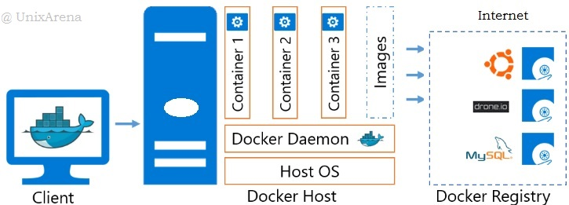
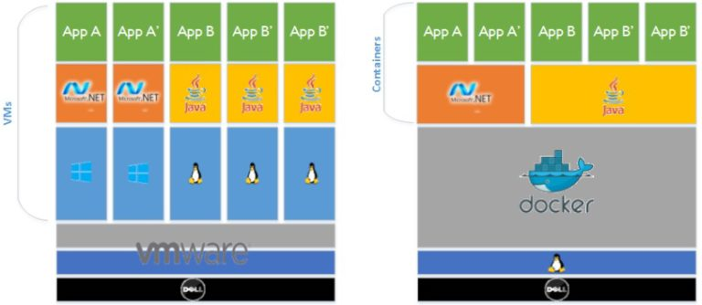

# [Docker For Professionals](https://www.udemy.com/docker-for-professionals-the-practical-guide)

- Docker concept is opposite to other existing hypervisor based virtualization technologies. Docker allows you to package an application with all of its dependencies into a standardized unit for software development.
- Docker containers wrap up a piece of software in a complete filesystem that contains everything it needs to run: code, run-time, system tools, system libraries – anything you can install on a server. This guarantees that it will always run the same, regardless of the environment it is running in.

Docker Engine (daemon) runs on the docker host along with docker client.  Docker client is used to launch  the docker container . Container is nothing but a  ready-made image which is available in docker repository.

If you compare the above image , we can see that docker engine is replacing the hypervisor layer. Docker engine shares the kernel with container and you no need to create the additional Guest OS layer  unlike VMware. This is similar to oracle Solaris zones and Linux container (lxc) but not exactly  same.

**_Sharing the Binary and Libraries_**

- Adding to that Docker also shares the Bins/Libs across the container.

